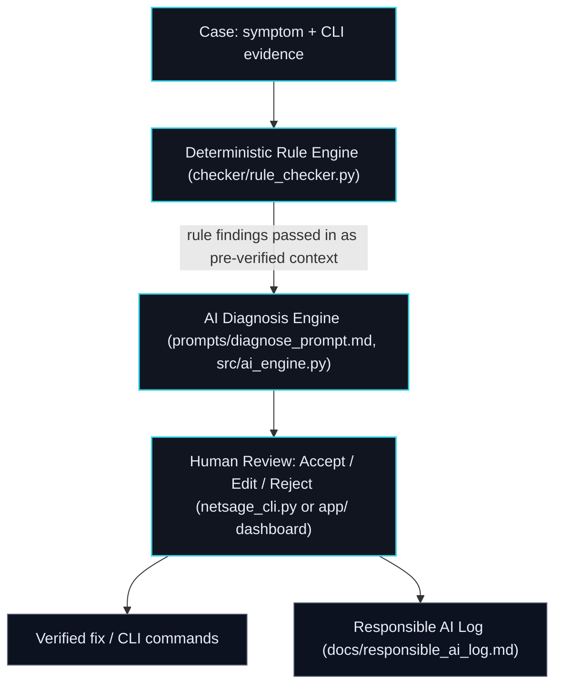

# NetSage AI — AI-Assisted Cisco Network Troubleshooting System

> Cisco internship problem statement — Applied AI + Network Troubleshooting

NetSage AI is an AI-assisted network troubleshooting assistant for Cisco
Packet Tracer labs. It analyzes symptoms, topology notes, and Cisco IOS
`show` command output to diagnose root causes across OSI layers,
recommend the next verification command, run deterministic config
checks, and enforce mandatory **human-in-the-loop (HITL)** review
before any fix is treated as final.

This build follows the same architecture as most NetSage-style Cisco
submissions (rule engine → AI engine → human review → dashboard → RAI
log) with an original frontend implementation.

## Architecture



The rule engine always runs first and its findings are fed into the AI
diagnosis prompt as pre-verified facts (see `_build_user_prompt` in
`src/ai_engine.py`) — the two stages run sequentially, not in parallel.

## Deliverables

| Deliverable | Location | Notes |
|---|---|---|
| Case dataset (30 cases) | `dataset/cases.csv`, `dataset/cases.json` | Covers Layer 1–7, 8+ networking domains |
| AI prompt library | `prompts/diagnose_prompt.md` | JSON schema, confidence scoring, evidence quoting, few-shot examples |
| Deterministic rule checker | `checker/rule_checker.py` | 15 regex-based Cisco IOS signature checks |
| AI diagnosis engine | `src/ai_engine.py` | Gemini call + offline fallback for reliability |
| Interactive terminal workbench | `netsage_cli.py` | Review cases and record decisions in the terminal |
| Web dashboard | `app/` | React + TypeScript + Vite, dark NOC-terminal theme |
| Responsible AI audit log | `docs/responsible_ai_log.md`, `app/src/data/raiLog.ts` | 5 real cases from this pipeline's own runs |
| Benchmark evaluator | `evaluate.py` | Scores rule trigger rate, AI accuracy, evidence grounding, human agreement |
| Master launcher | `run_all.py` | One menu for everything below |

## Quick start

### Prerequisites
- Python 3.10+
- Node.js 18+ and npm

### 1. Environment setup

**Linux / macOS (bash):**

```bash
cp .env.example .env
# edit .env and add your GEMINI_API_KEY
pip install -r requirements.txt --break-system-packages
```

`--break-system-packages` is only needed on distros (e.g. Debian/Ubuntu)
that mark the system Python as externally managed; drop it if `pip`
doesn't complain without it, or better, install into a virtualenv instead.

**Windows (PowerShell):**

```powershell
Copy-Item .env.example .env
# edit .env and add your GEMINI_API_KEY
pip install -r requirements.txt
```

If no API key is set, or the call fails/rate-limits, the AI engine
automatically falls back to an offline heuristic engine so the rest
of the pipeline (dashboard, CLI, evaluator) still runs — just with
weaker diagnoses. Add a real key for the AI engine to actually reason
over each case.

### 2. Run the master launcher

```bash
python run_all.py
```

```
 [1] Run Automated Benchmark Evaluation   (python evaluate.py)
 [2] Launch Interactive Terminal Workbench (python netsage_cli.py)
 [3] Launch Web Dashboard Dev Server        (cd app && npm run dev)
 [4] Run Rule Checker Only                  (python checker/rule_checker.py)
```

### 3. Web dashboard

```bash
cd app
npm install
npm run dev
```

Opens at `http://localhost:3000` with three tabs:
- **Diagnostic Workbench** — scenario selector, CLI evidence viewer, rule checker panel, AI diagnosis panel, human review (Accept/Edit/Reject)
- **Benchmark Metrics** — rule trigger rate, human agreement rate, OSI layer + domain coverage charts
- **Responsible AI Log** — interactive case study viewer

The dashboard currently runs its rule checker + offline diagnosis
engine entirely client-side (`app/src/engine.ts`, a TypeScript port of
`checker/rule_checker.py`) so it works with zero backend setup. To
wire it to a real LLM, add a small API route that calls
`src/ai_engine.py`'s `diagnose()` and swap `runDiagnosis()` in
`app/src/App.tsx` for a `fetch` call — never expose an LLM API key in
frontend code.

## Dataset schema

`dataset/cases.csv` columns:

| Column | Description |
|---|---|
| `case_id` | e.g. `NS-001` |
| `timestamp` | when the case was logged |
| `domain` | short concept tag, e.g. `VLAN`, `OSPF`, `NAT` |
| `osi_layer` / `osi_layer_name` | numeric layer + name, e.g. `3` / `Network` |
| `symptom` | plain-language description of the problem |
| `cli_snippet` | the Cisco IOS `show` output / evidence |
| `root_cause` | ground-truth root cause |
| `confidence` / `confidence_tier` | numeric confidence (0–1) + `low`/`medium`/`high` label |
| `next_command_device` / `next_command_cmd` | which device to run the verification command on, and what it is |
| `fix_step_1/2/3` | up to three remediation steps |
| `outcome` | resolution status |

## Responsible AI & safety principles

1. **Human-in-the-loop safety gate** — every AI diagnosis is a proposal, never a final action. A human must accept, edit, or reject it before any fix is applied.
2. **Evidence grounding** — the prompt library forces the model to quote the specific evidence line supporting its diagnosis, and to lower its confidence rather than invent evidence it doesn't have.
3. **Least-privilege guardrails** — the prompt explicitly forbids overly broad fixes (e.g. never `permit ip any any` as an ACL/NAT fix).
4. **Documented failure modes** — `docs/responsible_ai_log.md` records real cases where the AI needed correction, not just cases where it succeeded.

## Repository structure

```
netsage-ai/
├── README.md
├── requirements.txt
├── .env.example
├── run_all.py
├── evaluate.py
├── netsage_cli.py
├── dataset/
│   ├── cases.csv
│   └── cases.json
├── prompts/
│   └── diagnose_prompt.md
├── checker/
│   └── rule_checker.py
├── src/
│   ├── models.py
│   └── ai_engine.py
├── docs/
│   └── responsible_ai_log.md
└── app/                       # React + TypeScript + Vite dashboard
    ├── index.html
    ├── package.json
    └── src/
        ├── App.tsx
        ├── engine.ts           # browser-side rule checker + offline diagnosis
        ├── types.ts
        ├── index.css           # dark NOC-terminal design system
        ├── data/
        │   ├── cases.json
        │   └── raiLog.ts
        └── components/
            ├── Header.tsx
            ├── CaseSelector.tsx
            ├── CliViewer.tsx
            ├── RuleCheckPanel.tsx
            ├── AiDiagnosisPanel.tsx
            ├── HumanReviewPanel.tsx
            ├── MetricsDashboard.tsx
            └── RaiLogPanel.tsx
```
